# 结题报告

本报告中所谈及的具体细节可以参考： [Notion](https://www.notion.so/oshchital/RVisor-Developing-Wiki-d3f127a7d0f0405f8486f74e5ce29987)

- [结题报告](#结题报告)
  * [1 项目简介](#1-项目简介)
  * [2 背景和立项依据](#2-背景和立项依据)
    + [2.1 项目背景](#21-项目背景)
      - [传统容器的安全性问题](#传统容器的安全性问题)
      - [传统容器缺乏安全性的原因](#传统容器缺乏安全性的原因)
      - [解决传统容器安全性问题的尝试](#解决传统容器安全性问题的尝试)
      - [gVisor 以及其中存在的问题](#gvisor-以及其中存在的问题)
    + [2.2 rVisor 方案的大体设计](#22-rvisor-方案的大体设计)
  * [3 rVisor 设计思路](#3-rvisor-设计思路)
    + [3.1 rVisor 整体架构](#31-rvisor-整体架构)
    + [3.2 rVisor-kernel 整体设计思路](#32-rvisor-kernel-整体设计思路)
      - [3.2.1 保证 rVisor 的兼容性 - zCore](#321-保证-rvisor-的兼容性---zcore)
        * [选用 zCore 相比使用其他 Rust 编写的操作系统内核的优势](#选用-zcore-相比使用其他-rust-编写的操作系统内核的优势)
      - [3.2.2 保证 rVisor 的安全性 - 实现宿主机与容器的隔离](#322-保证-rvisor-的安全性---实现宿主机与容器的隔离)
        * [限制内核模块中使用的 Linux 内核函数和系统调用](#限制内核模块中使用的-linux-内核函数和系统调用)
        * [将 zCore 的内存空间与宿主机隔离](#将-zcore-的内存空间与宿主机隔离)
      - [3.2.3 保证 rVisor 的安全性 - 实现容器与容器的隔离](#323-保证-rvisor-的安全性---实现容器与容器的隔离)
      - [3.2.4 保证 rVisor 的性能](#324-保证-rvisor-的性能)
    + [3.3 rVisor 的外部组件](#33-rvisor-的外部组件)
      - [3.3.1 runrSC](#331-runrsc)
      - [3.3.2 containerd-shim](#332-containerd-shim)
  * [4 rVisor 实现效果和演示](#4-rvisor-实现效果和演示)
    + [实现的系统调用列表](#实现的系统调用列表)
    + [效果演示](#效果演示)
    + [简单的 benchmark](#简单的-benchmark)
  * [5 总结](#5-总结)
    + [5.1 项目总结](#51-项目总结)
    + [5.2 组员分工与贡献](#52-组员分工与贡献)
  * [6 致谢](#6-致谢)
  * [参考文献](#参考文献)

## 1 项目简介

随着容器技术的不断发展，传统容器隔离性不足的缺陷逐渐暴露了出来，为了解决传统容器隔离性不足的问题，AWS 和 Google 分别提出了 Kata Container 和 gVisor 这两种安全容器技术。

gVisor 是一种轻量级的容器技术，通过系统调用劫持，为应用程序打造一个虚拟的内核环境，是一种比 Kata Container 更为轻量的的安全容器实现。

但 gVisor 采用的系统调用劫持的方法，会使得每一次系统调用的过程中都发生一次上下文切换，带来的性能问题比较严重，并不适用于生产环境。同时，作为独立的一个操作系统内核，gVisor 采用 Go 语言编写也并不合适，会带来性能上的瓶颈和较大的运行时开销。

针对以上问题，我们提出 rVisor，rVisor 为一个由 rust 编写的基于用户空间（User Space）的通用安全沙箱环境。rVisor 利用在内核中进行系统调用劫持的方法，避免频繁的内核态用户态切换所带来的性能开销，同时使用 Rust 语言，在保证安全性的同时解决 Go 语言 GC 所带来的 Stop the World 问题，力求获得可以媲美原生应用的性能。

此外，项目的runrsC与contained-shim两个外部组件让我们可以从containerd调用rVisor，为rVisor的未来部署和使用提供了基础。

## 2 背景和立项依据

### 2.1 项目背景

#### 传统容器的安全性问题

众所周知，容器化、微服务化、云原生化是当前 IT 系统演进的趋势。根据 Portworks 和 Aqua Security 的调查报告显示，被调查的大多数企业都不是正在使用容器，就是考虑使用容器。但是随着容器技术的不断发展，传统容器隔离性不足的问题逐渐暴露出来。

关于这个问题 Tripwire 做过的一次调查报告。Tripwire 调查了311名管理容器的专家。我们可以看到，大概有半数的企业，尤其是运行了 100 个以上容器的企业，认为他们的容器是有安全漏洞的。

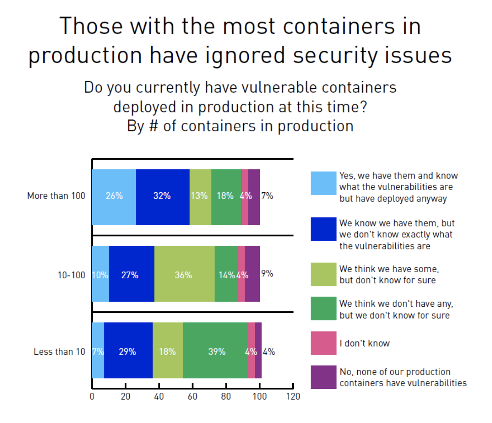

这种安全问题使得有 42% 的受访者无法完全地拥抱容器生态，可以说，传统容器的安全问题日益成为容器技术发展的一个阻碍。

#### 传统容器缺乏安全性的原因

传统容器使用 Namespace/Cgroup 实现，这套容器技术实际上同样是从进程调度的角度入手，对内核进行的功能扩展，优势上来说，操作界面很 Linux、很方便，开销也很低，可以被用来无负担地套在已有应用外面来构建隔离的环境，并且它是纯软件方案，不和其他层面的物理机、虚拟机相冲突。

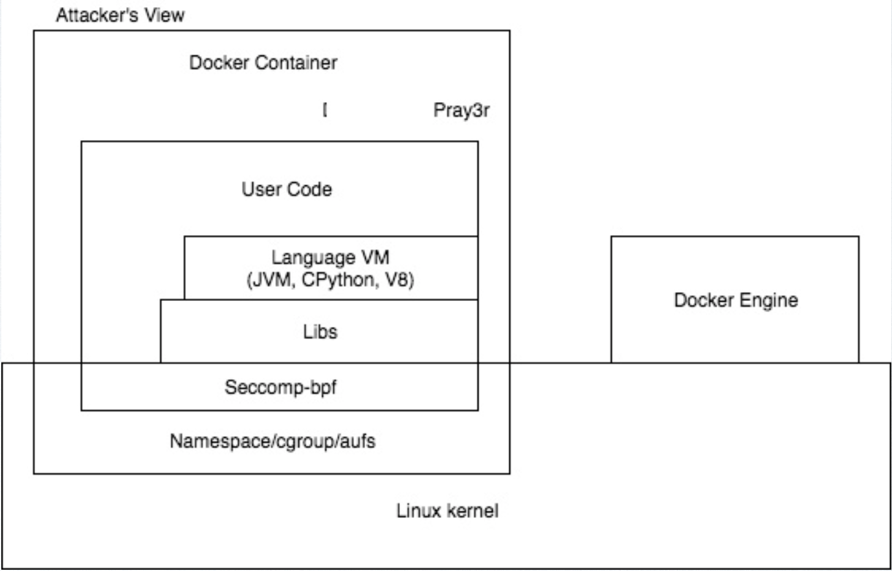

Namespace/Cgroup 是内核的一个部分，其中运行的容器仍然使用主机的 Linux 内核，他解决不了Linux内核中隔离性差的问题，攻击者可以利用Linux内核的漏洞来实施攻击，进而实现容器逃逸，然后便可以直接对宿主机进行攻击。

#### 解决传统容器安全性问题的尝试

我们知道攻击者会利用Linux内部的漏洞来实施攻击，那么让 Linux 内核解决全部安全问题是否可行呢？事实上，这还是一件比较困难的一件事。

主要原因在于，Linux他自身呢在不断更新和扩展，内核会不可避免地变得越来愈大，在这种扩大的过程中，安全是不可避免的问题。Linus 在 2015 年西雅图的 LinuxCon 上，就曾提到过这个问题。（原文为 *It’s always really hard to try to get rid of unnecessary fat, because as every developer knows, things tend to grow …*）

Linus 针对这种安全性问题的回答是，一方面在对安全性要求不高的场合下，你可以允许这些 bug 发生，另一方面，在安全性要求比较高的场合下，可以在 Linux 的基础上对计算资源建立一层新的抽象。这样的话，如果一个组件有一个漏洞，另一个组件或许能够捕获到它，这样就可以更大程度上保证安全。（原文为 *only real solution is to admit that bugs happen, and try to mitigate them by having multiple layers of security, so that if you have a hole in one component, the next component will catch it.*）

为了增加一层新的抽象，目前有这样的几个主流思路思路：

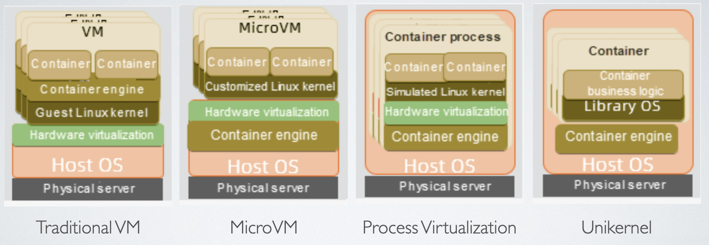

* 首先，最简单的方案就是把容器放在虚拟机里跑，这种方式不需要对软件栈做改动，只是让同一个用户的容器跑在自己的虚拟机里，但这样带来的问题，除了额外的开销之外，还有两层的维护复杂度。
* 另一种源远流长的独立内核的方案是 unikernel，让应用自己带上自己的内核，这种方式的好处是最简化的 LibOS 不仅可以有更小的开销，也可以有更小的攻击面，但阻止它被更广泛应用的问题在于它往往需要修改应用，兼容性永远是平台技术被采纳的最大障碍。

近年来，在解决容器安全这个问题上，又出现了两种新的解决方案：

* MicroVM 是一种轻量级的虚拟机，使用裁剪过的内核，尽可能的减少传统虚拟机所带来的开销，这时MicroVM在保持容器效率的基础上实现了良好的兼容性，用户直接面对虚拟机的内核，无法对系统内核作出攻击。
* 另一个方法是进程虚拟化，进程虚拟化的方法使用一个特定的内核来运行 Linux 二进制文件，它直接虚拟化Linux的运行环境，而不使用原来完整的 Linux镜像。可以在保证轻量性的同时为Linux应用提供尽可能大的兼容性。同时，应用程序面对着的是全新的内核，也难以对原有的内核进行有效的攻击。

相关的实现又很多，我们这里只谈两个比较主流的实现：

* Kata Container 是MicroVM的一个经典的实现实现，它提供了一个MicroVM，并且有专门提供给 Kubernetes 使用的接口，有比较好的安全性和运行效率，现在已经开始逐步使用。但是其启动时间和内存占用与传统容器还有一定的差距。
* 而 gVisor 是基于进程虚拟化的容器实现，他拥有很好的隔离性，很小的内存占用和启动时间，但是系统调用效率不高，这是我们解决的重点问题。

#### gVisor 以及其中存在的问题

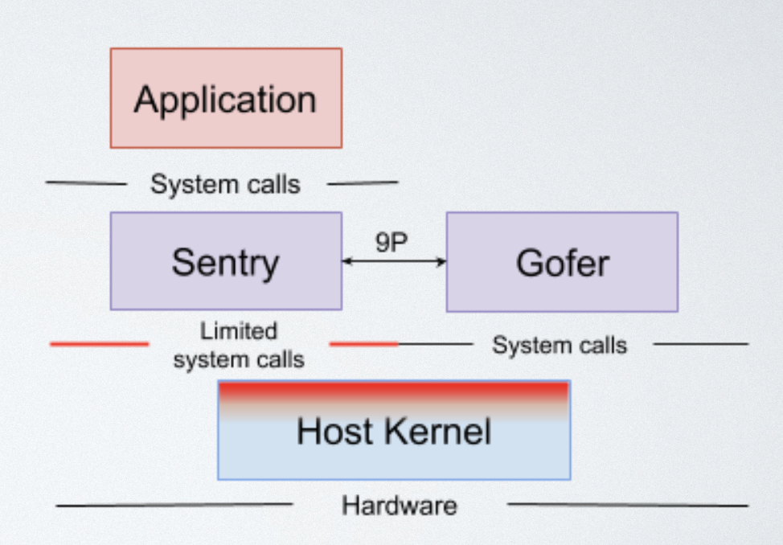

gVisor 的大体结构是由 Sentry 和 Gofer 两个部分组成的。

Sentry 本身构成一个系统内核，对应用程序的一切系统调用做出回应，Sentry 所需要的一些系统功能由 Host Kernel 提供，但是 Sentry 只是用很小部分系统调用，有这样的保证呢，它就可以在内核和应用直接建立起了一层新的抽象。
Sentry 访问文件系统时，要通过 Gofer 进程处理，Gofer 进程可以使用完整的系统调用，但Sentry和Gofer使用严格的9P协议链接，有力的对不同组件进行解耦，防止不安全的系统调用。

最后，gVisor 采用 Go 语言编写，相比较C语言而言， Go 的 GC 机制呢可以有效地保证内存的安全，这也给系统的安全性提供了强有力的保障。

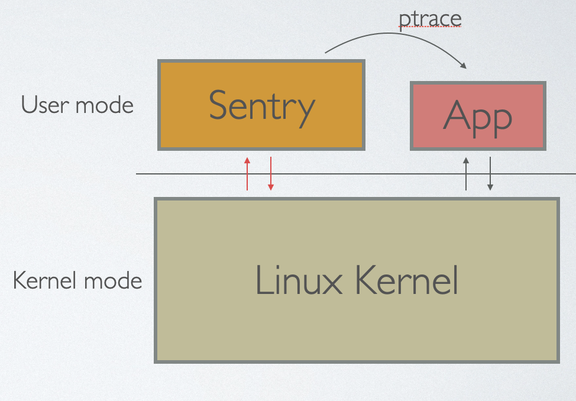

但是 gVisor，我们虽然平常经常将它和Kata Container 并列，但它像 Kata Container 那样被逐步开始使用，gVisor 在性能上有比较大的问题。这个问题主要表现在两个方面。

一方面，gVisor 使用 Linux 提供的 ptrace 实现，ptrace 是一个用于调试进程的系统的调用，主要用于 gdb 以及 strace 这样的调试分析工具。不过 ptrace 系统调用非常强大，强大到 ptrace 可以支持这种将一个进程完全控制，捕获应用程序的所有系统调用和事件，但是 ptrace 在效率上有一定的问题。

应用程序在调用系统调用时，会进入内核态，然后内核会唤醒 Sentry 进程让 Sentry 进程执行，Sentry 进程执行完后，再进行一次系统调用切换到内核态，内核态继续转到应用程序中运行。

这样的过程中会出现大量的内核态到用户态的切换，这个过程中会出现大量的上下文切换。

这个开销在以计算为主的应用比如深度学习环境下不是很大的问题，但它在需要使用大量系统调用的、这种IO密集型的服务端容器运行环境内是难以接受的，Xu Wang 和 Fupan Li 做了一组 benchmark，可以看到，gVisor 在 Nginx 上比 runC 和 Kata 慢了将近 50 倍。这个数据足以显示出 gVisor 的在系统调用密集的应用中性能与 Kata 和原本的 docker、runc 还是有较大差距。

另一方面，Go 的 GC 虽然保证了 gVisor 的安全性，但毕竟 gVisor 是一个操作系统内核，使用 Go 这种带有 GC 的语言编写并不合适，容易在运行容器时出现 Stop the World 的问题。

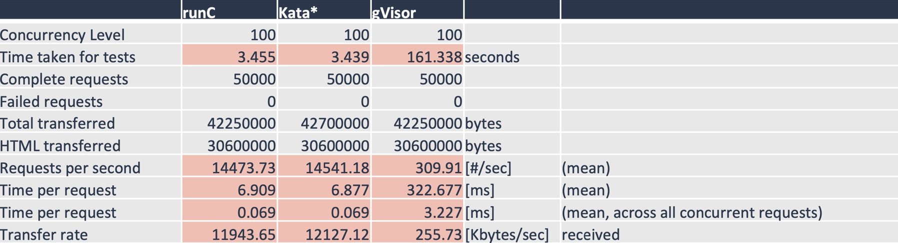

### 2.2 rVisor 方案的大体设计

针对 gVisor的这两个问题，rVisor 提出另一种轻量的安全容器方案。

* rVisor 使用 Rust 语言编写，具有和 Go 语言同样好的安全性
* gVisor 对系统调用的使用进行了严格的限制，他仅仅使用了不到20条系统调用来与 Linux 交互。rVisor 同样地将不安全的系统调用显式地用 rust unsafe 表示出来，同时尽可能将这种不安全性降低到最少，这样可以实现与 gVisor 同等的安全性。
* rVisor 作为一个内核模块，它使用系统调用劫持的方法实现安全沙箱环境。rVisor 自身使用一个独立的内核，用户程序并不直接与宿主机内核想交互。
* 同时，gVisor 在进行 ptrace 的同时，会进行多次进程切换，而 rVisor 使用系统调用劫持的过程中 Linux 用户线程不会改变，只会进行最简单的上下文切换，总而使 rVisor 拥有可以媲美原生应用的性能。

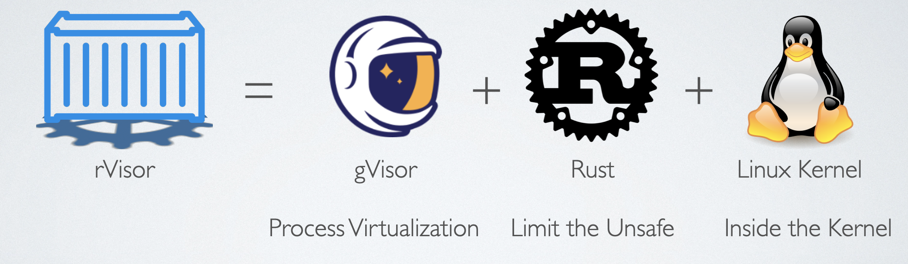

rVisor 力求在 gVisor 的基础上，解决系统调用效率低的问题，同时争取获得比 Kata Container 更小的内存占用和启动时间，获得更为广泛的应用场景。

同时 rVisor 与容器的生态相结合，使用 containerd 可以在 rVisor 中运行 docker 生态中的容器镜像，并且可以受 kubernetes 调度。

## 3 rVisor 设计思路

### 3.1 rVisor 整体架构

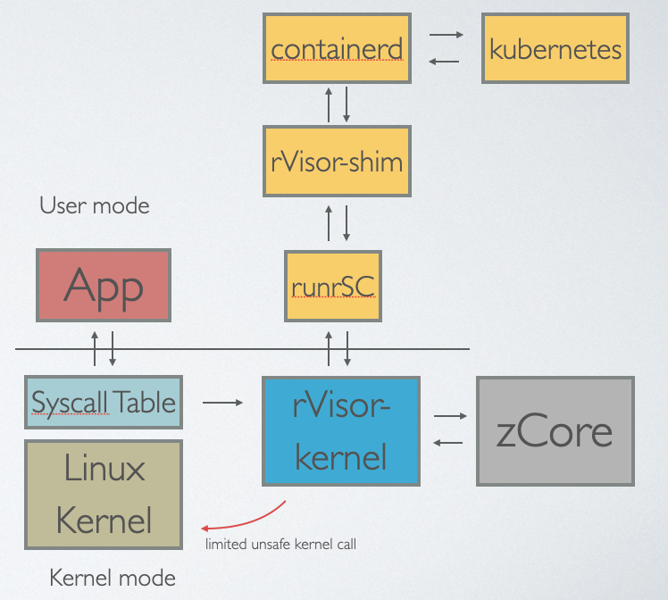

* rVisor-kernel: rVisor 的核心部件，实现容器的基本功能。
* zCore：我们为 rVisor 专门改写的内核，也是用户程序所直接面对的内核。
* runrSC: rVisor 的命令行客户端，为 rVisor-shim 提供接口，也可以当作简单的客户端使用。
* rVisor-shim 将我们整体架构与 containerd 连接，使得 rVisor 可以运行现有的容器，与现有容器生态结合。

### 3.2 rVisor-kernel 整体设计思路

然后我们 rVisor-kernel 的整体设计如下：

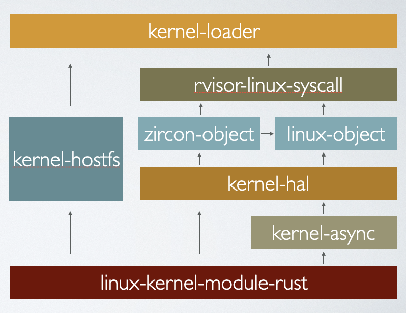

* 首先，kernel-loader实现了我们整体的内核模块，包括容器架构的实现，系统调用劫持的代码。
* kernel-hostfs 作为我们在内核中实现的一个“本机文件系统”，也就是通过给本机进行系统调用的文件系统，我们将这个文件系统挂载到 zCore 里面就被 zCore 使用了，这一部分由郑在一同学完成。
* kernel-async 这一部分我们添加了对 Rust async 语法的支持，使得 zCore 可以运行多个线程。
* zircon-object、linux-object 是我们从 zCore 内核移植过来的关键模块。
* rvisor-linux-syscall 是我们针对 zCore 实现的所有系统调用。

我们会重点围绕 rVisor 的兼容性、安全性、性能这样几个方面来介绍我们的设计。

#### 3.2.1 保证 rVisor 的兼容性 - zCore

为了保证 rVisor 的兼容性，我们的选择 zCore 作为 rVisor 的内核，zCore 是一个用 Rust 编写的 Zircon 微内核，借鉴自 Fuchsia OS，同时可以作为 Linux 内核使用。

同时，我们的重点不是去设计一个具体的内核，我们希望使用一个现有的内核来简化我们的开发。

zCore 是清华他们 OS 课程实验的一个项目，是由多届助教和学生共同开发的，相比我们自己独立开发要更为完善。对 Linux 系统调用也有比较好的支持，我们整体上使用 zCore 来保证 rVisor 系统的兼容性。

##### 选用 zCore 相比使用其他 Rust 编写的操作系统内核的优势

首先，选择 zCore 最主要的一点在于 zCore 是一个设计理念非常先进的系统，既可以作为 Zircon 微内核，又可以作为 Linux 内核，既可以在裸金属上运行，也可以作为 LibOS 在用户态运行。它对硬件做了非常好的抽象，方便我们移植。其他的用 Rust 编写的操作系统都很难做到这一点。

然后相比一些其他用 Rust 编写的操作系统，比如说 RedoxOS，RedoxOS 也是一个用 Rust 编写的较为成熟的微内核操作系统。但 Redox 整体不仅仅是一个简单的内核，还包含其他的一系列操作系统组件和 GUI，结构非常复杂，不利于我们修改和使用。然后zCore 本身要比 Redox 简单很多。更利于我们使用。同时，zCore 相比 RedoxOS 更为轻量，只有 1w 行代码，它可以保证我们容器的内存占用和启动时间。

另外，zCore 还算是比较成熟的操作系统内核，对于我们的实验来说已经足够了，如果需要更为完善的操作系统内核，我们对在内核中的硬件做了一定程度的抽象，进一步也可以选择其他的操作系统内核来移植。

#### 3.2.2 保证 rVisor 的安全性 - 实现宿主机与容器的隔离

实现宿主机与容器的隔离，我们主要采取了两个措施：一方面，限制内核模块中使用的 Linux 内核函数和系统调用，另一方面，将 zCore 的内存空间与宿主机隔离。

##### 限制内核模块中使用的 Linux 内核函数和系统调用

RVisor 的所有系统调用都是通过 zCore 间接完成的，我们为 zCore 在内核中的运行提供基本的支持，然后所有系统调用都直接交由 zCore 运行。为了保证 rVisor 的安全性，我们像 gVisor 一样严格地控制使用的系统调用，具体使用的系统调用都是一些基本的系统调用，包括一些对文件系统的操作以及其他的一些系统调用。

另外我们还使用了一些基本的内核函数，这些内核函数的安全性是可以保证的。

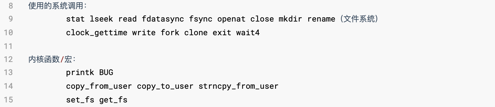

##### 将 zCore 的内存空间与宿主机隔离

rVisor 使用 mmap 系统调用为 zCore 分配内存，Mmap 系统调用可以将文件的内容同步映射到内存上，一般用来实现分配内存、共享内存、加载动态库之类的功能。

RVisor 创建一个 tmpfs 文件作为物理地址空间，然后我们修改了 zCore，zCore 会使用 mmap 来完成用户虚拟地址空间到tmpfs 文件物理地址空间的映射。这样 zCore 就可以获得一个与原有 Linux 内核完全独立的物理内存空间，这样 RVisor 内部的内存系统可以完整地与 Linux 宿主机隔离。

由于 tmpfs 是一个在内存中运行的文件系统，`read/write` 都是在内存中完成的，所以这个过程不会造成很大的磁盘IO 开销。

#### 3.2.3 保证 rVisor 的安全性 - 实现容器与容器的隔离

我们在设计容器架构的时候，除了需要注意宿主机与容器的隔离之外，还有关注容器与容器之间的隔离。

* 内存管理的隔离：为了实现容器和容器层面的隔离，我们会对 zCore 中的一部分可以被多个进程进行访问的静态变量进行处理，比如我们为了保证每个 zCore 容器拥有不同的物理地址，可以将每个容器都提供一个临时文件作为物理地址，同时提供一个独立的空闲帧表。这样不同的 zCore 容器就会拥有不同的物理内存，可以保证不同容器之间的隔离。

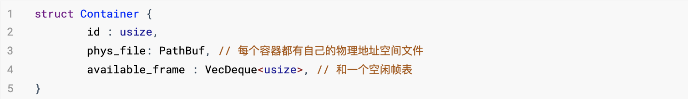

* 文件系统的隔离：这里我们的方法就是利用 zCore 每个进程都有独立的文件系统指针，而且 zCore 没有没有全局的静态文件系统，这样可以有效保证进程不会访问到其他的容器的文件系统。

#### 3.2.4 保证 rVisor 的性能

rVisor-kernel 利用系统调用劫持，这个过程中只会出现两次内核态和用户态之间的转换。同时 rVisor-kernel 整体在内核中运行，有效地避免了在用户空间的 gVisor 频繁地上下文切换问题。

rVisor 的系统调用劫持与 Linux 原生的系统调用运行过程基本相同，有可以媲美原生应用的性能。

后面对 rVisor 对性能进行了简单的测试。

### 3.3 rVisor 的外部组件

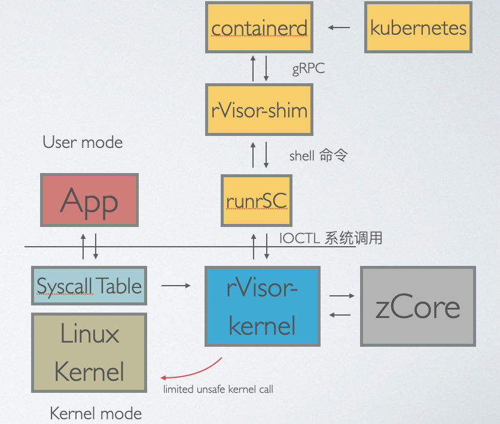

rVisor 的外部组件主要包括 runrSC 和 rVisor-shim 两部分。

#### 3.3.1 runrSC

runrsC 允许用户直接控制内核中的 rVisor，这一部分工作由何灏迪同学完成。

这里我们为了避免 rVisor 增加系统调用，RVisor 会创建一个虚拟设备节点来实现与用户空间的交互，runrsC会从外部使用 ioctl 与rVisor 交互。runrsC 允许用户直接控制内核中的 rVisor 了。

runrsC 还会使用 cgroup 来对整个进程的资源进行限制。

runrSC 的与内核的具体接口如下：

#### 3.3.2 containerd-shim

containerd-shim 为 runrsc 提供  containerd 接口，使得 rVisor 可以运行由 containerd 提供的各种容器。containerd-shim 通过 gRPC 与 containerd 交互，遵循 containerd-shim v1 标准。这一部分由叶之帆同学完成

下图为 rvisor-shim 支持的所有 gRPC 远程调用。

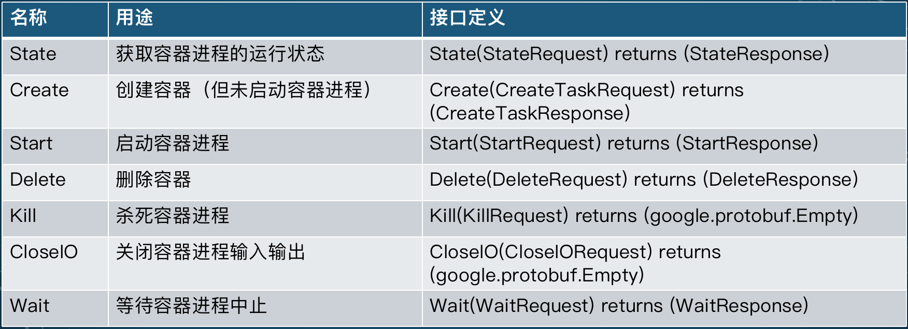

## 4 rVisor 实现效果和演示

### 实现的系统调用列表

`rVisor-linux-syscall` 实现了几乎所有 zCore 支持的系统调用，总共支持53条。

目前的 rVisor 的实现还比较简陋，并不能运行所有 Linux 程序。

### 效果演示

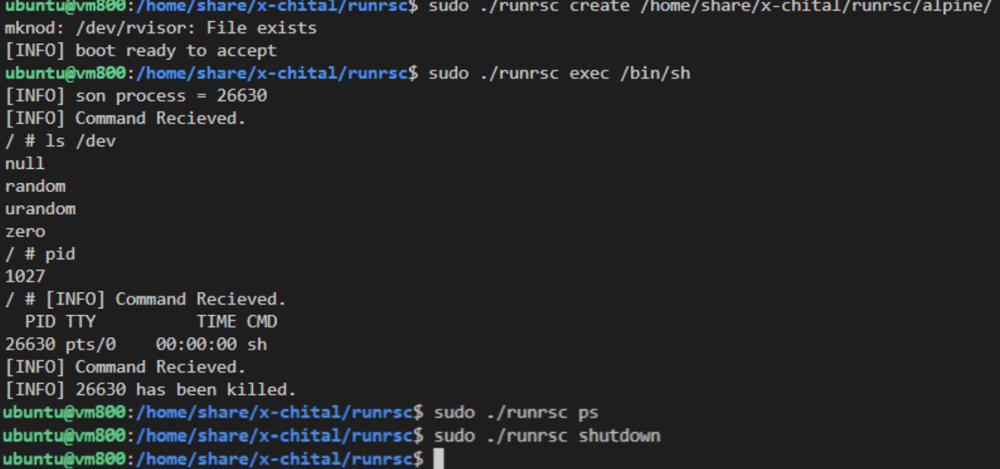

整个程序是使用 runrsc 在我们自己编写的一个 shell 和一个 alpine 镜像中运行的。

可以观察到：

* 内部的 pid 和外部的 pid 不一样。
* 可以运行像 ls 这种简单的 busybox 命令。
* zCore 在 /dev 中只支持四个设备

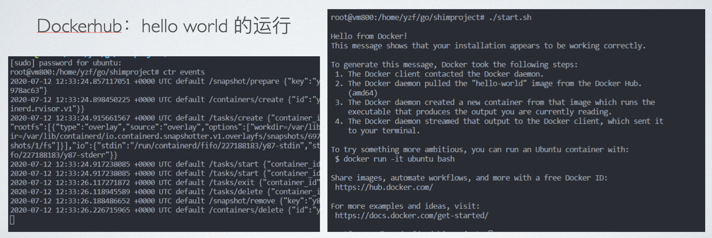

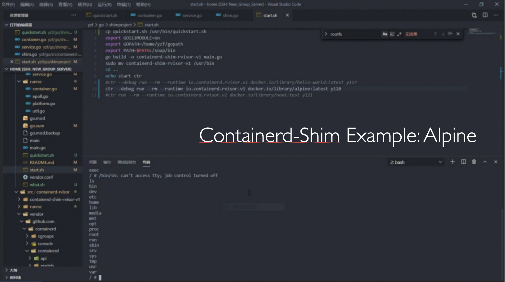

上面两张图是使用 containerd 运行 helloworld 和我们修改过的一个 alpine 镜像的结果。

### 简单的 benchmark

我们使用简单的文件 IO 和文件创建删除做了一些简单的 benchmark，其中 rVisor 在 `cargo build --release` 下运行。

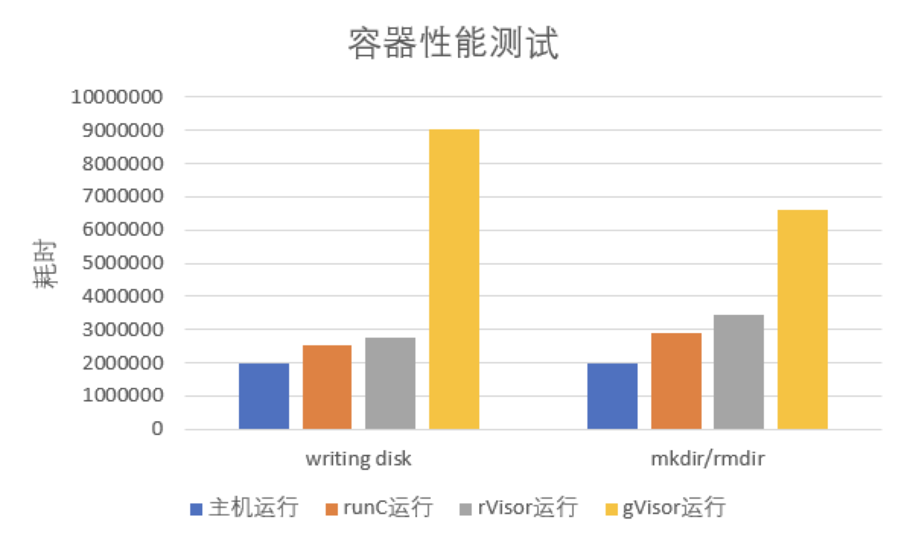

可以看到，rvisor 拥有与宿主机相近的耗时，benchmark的具体数据见下图。

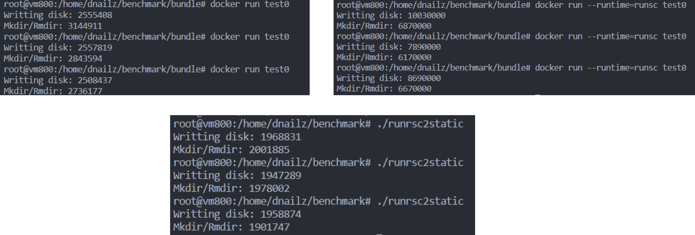
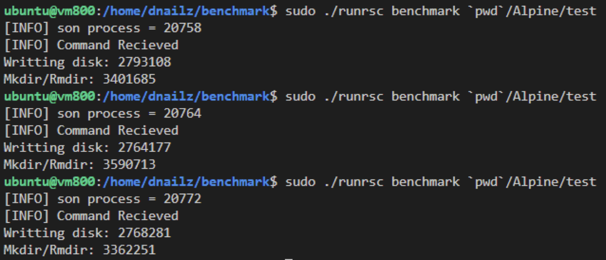

## 5 总结

### 5.1 项目总结

本项目致力于实现更为轻量高效的安全容器，并在这个过程中学习操作系统内核的设计方法，最终实现了一个简易的拥有独立内核的安全沙箱架构，收获颇丰。

本项目最大的难点在于内核的移植，虽然用 Rust 编写的操作系统内核很多，要找到一个便于移植的，对 Linux 又一定支持的内核其实还是一件比较困难的事情。本小组在调查资料的过程中偶然发现了 zCore，zCore 良好的可移植性和代码的可复用性深深地吸引了我们，最终我们在诸多操作系统内核中选用 zCore 作为 rVisor 的内核，在这个过程中，我们也阅读了 zCore 的代码，学习了很多 Rust 语言和 OS 内核设计的方法。

本项目另一个非常有挑战性的问题在于如何在 Linux 内核中建立与 Linux 内核的隔离。rVisor 运行在内核态，必须保证不调用特别危险的内核函数，这就以为着很多功能我们不能直接从 Linux 内核调用函数解决，不过好在 Rust no_std 的生态非常丰富，我们可以用 spin::Mutex 来代替自旋锁，用 trapframe 来表示 x86 上下文的寄存器，这些工具大大减少了我们与 Linux 内核的交互，同时也方便了我们的开发。

本项目在兼容性和安全性方面还有待进一步改进，zCore 还需要进一步完善，同时 rvisor 的安全性也需要在实践中进一步检验。

### 5.2 组员分工与贡献

组长丁垣天主要完成整个项目的设计和 rvisor-kernel 与 zCore 的移植问题。

何灏迪和叶之帆同学分别完成了 runrsc 和 rvisor-shim 使得 rVisor 可以与现有容器生态对接，同时完成了对验证 rvisor 可用性非常重要的 benchmark 工作。

郑在一同学完成了 `kernel-hostfs` 这一部分，这一部分设计到大量的系统调用，编写容易出现 unsafe，对 rVisor 的安全性有重要影响。同时郑在一同学还对整个 rvisor 使用的系统调用进行了分析。

## 6 致谢

首先感谢邢凯老师对本项目提供的指导，包括选题和项目设计的建议。

感谢付佳伟助教提供的 vlab-kvm 虚拟机，使得全组同学可以在同一台机器上同步地进行开发和调试，大大方便了我们的开发。

感谢清华大学王润基同学对我们使用 zCore 过程中提供的帮助。

## 参考文献

[gVisor是什么？可以解决什么问题？](https://blog.csdn.net/M2l0ZgSsVc7r69eFdTj/article/details/82754587)

[tripwire 调查报告](https://www.tripwire.com/-/media/tripwiredotcom/files/white-paper/tripwire_state_of_container_security_report.pdf?rev=911c7b876c9d46bf86e626fd81ecf0b0)

[谷歌黑科技：gVisor轻量级容器运行时沙箱](https://blog.csdn.net/qq_36512792/article/details/80503211)

[ptrace 参考](https://blog.csdn.net/jxxiaohou/article/details/8985824)

[LinuxCon-2015](https://siliconangle.com/2015/11/10/linux-creator-linus-torvalds-says-open-source-helps-to-push-the-next-agenda-linuxcon2015/)

[传统容器已死，安全容器将成为云原生标配](https://zhuanlan.zhihu.com/p/99182075)

[zCore 主页及文档](https://github.com/rcore-os/zCore)

