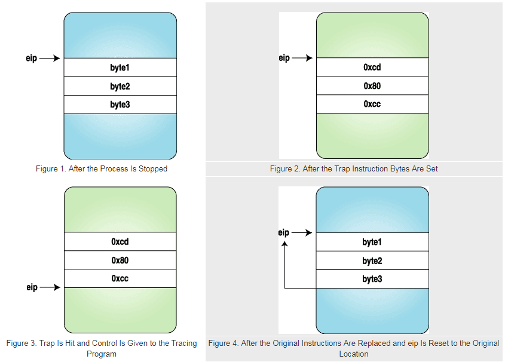

# 可行性报告

## 项目简介

rVisor 为一个基于用户空间（User Space）的通用安全沙箱环境。参考 gVisor 利用系统调用劫持的方法，实现进程级的虚拟化。在gVisor的基础上， 提供更高层次的共享机制，避免 go 语言 GC 的开销，为程序提供轻量高效的运行环境。

为 rVisor 避免 rVisor 在系统调用过程中的开销，在 rVisor 大体完成后，可以考虑将 rVisor 整体移入 Linux 内核，尝试解决 gVisor 进程级虚拟化的性能问题。

## 理论依据

### 安全沙箱

安全沙箱是一种用于隔离正在运行的程序的安全机制，通常是为了减轻系统故障或软件漏洞的蔓延。它通常用于运行未经测试或不受信任的软件，保护主机和操作系统免遭侵害。

沙箱为运行在其中的程序提供严格控制的资源集，如内存、外存的访问权限等等。沙箱通常也提供严格的网络访问控制、输入输出设备访问控制等。在本方案中，通过劫持系统调用严格监控、限制程序的访问权限。

安全沙箱的实现可以参考：Windows Sanbox , JAVA Sandbox等。

rVisor 本身就是一个安全的应用沙箱，利用 Linux 的 ptrace 系统调用实现。可以提供轻量的进程级虚拟化。

## 技术依据

### ptrace 系统调用

#### 概述

```c
#include <sys/ptrace.h> 
int ptrace(int request, int pid, int addr, int data);
```

ptrace系统调用提供了一个进程监视并修改另一个进程执行过程的能力。通过设置不同的request参数，父进程可以拦截被子进程的系统调用，读取、修改被子进程的内核镜像与寄存器的值。

常用的request参数如下：

| **请求**                         | **作用**                                           |
| -------------------------------- | -------------------------------------------------- |
| PTRACE_TRACEME                   | 本进程请求被其父进程所跟踪                         |
| PTRACE_PEEKTEXT, PTRACE_PEEKDATA | 从内存地址中读取一个字节，内存地址由addr给出       |
| PTRACE_POKETEXT, PTRACE_POKEDATA | 往内存地址中写入一个字节，内存地址由addr给出       |
| PTRACE_PEEKUSR                   | 从USER区域（含寄存器）中读取一个字节，偏移量为addr |
| PTRACE_POKEUSR                   | 往USER区域（含寄存器）中写入一个字节，偏移量为addr |
| PTRACE_GETREGS                   | 读取全部寄存器的值                                 |
| PTRACE_SYSCALL                   | 使子进程恢复运行，拦截下一次子进程发起的系统调用   |
| PTRACE_CONT                      | 使子进程恢复运行                                   |
| PTRACE_SINGLESTEP                | 使子进程恢复运行并设置单步执行标志                 |
| PTRACE_KILL                      | 杀掉子进程，使它退出                               |
| PTRACE_ATTACH                    | 跟踪指定pid 进程                                   |
| PTRACE_DETACH                    | 结束跟踪                                           |

#### 实例

一个（i386下）简单的使用ptrace的实例如下：

```c
#include <sys/ptrace.h>
#include <sys/types.h>
#include <sys/wait.h>
#include <unistd.h>
#include <linux/user.h>   

int main()
{   pid_t child;
    long orig_eax;
    child = fork();
    if(child == 0) {							//子进程部分
        ptrace(PTRACE_TRACEME, 0, NULL, NULL);	//子进程请求被监视
        execl("/bin/ls", "ls", NULL);			//子进程发起系统调用，此时子进程中断，唤醒父进程
    }
    else {										//父进程部分
        wait(NULL);								//等待至子进程发起系统调用
        orig_eax = ptrace(PTRACE_PEEKUSER,		
                          child, 4 * ORIG_EAX,
                          NULL);				//读取eax寄存器的值，本例(i386)保存系统调用号
        printf("The child made a "
               "system call %ld\n", orig_eax);
        ptrace(PTRACE_CONT, child, NULL, NULL);	//返回到子进程
    }
    return 0;
}
```

上例将会输出：

```markdown
The child made a system call 11
#ls的具体输出
```

若在上例的`wait(NULL)`至`ptrace(PTRACE_CONT,...)`段写入其他ptrace调用，则可以实现如读写子进程寄存器值、系统调用的参数、读写子进程内存地址等等功能。通过这些手段实现安全沙箱的功能。

更多实例可见：[Playing with ptrace, Part I](https://www.linuxjournal.com/article/6100)与 [Playing with ptrace, Part II](https://www.linuxjournal.com/article/6210)

#### ptrace执行过程

1. 父进程fork出子进程后进入等待，子进程请求被父进程跟踪
2. 当子进程调用系统调用后，父进程被唤醒
3. 父进程通过ptrace调用处理子进程
4. 子进程恢复执行，父进程继续跟踪

#### 更多用法

##### attach&detach

当两个进程间不互为父子进程时，调用`ptrace(PTRACE_ATTACH,...)`实现跟踪。父进程调用`ptrace(PTRACE_DETACH,...)`解除跟踪。

下列代码段实现了跟踪->输出第一次系统调用的信息->解除跟踪的过程：

```c
    ptrace(PTRACE_ATTACH, traced_process,
           NULL, NULL);
    wait(NULL);
    ptrace(PTRACE_GETREGS, traced_process,
           NULL, &regs);
    ins = ptrace(PTRACE_PEEKTEXT, traced_process,
                 regs.eip, NULL);
    printf("EIP: %lx Instruction executed: %lx\n",
           regs.eip, ins);
    ptrace(PTRACE_DETACH, traced_process,
           NULL, NULL);
```

##### 设置断点与代码注入

基本实现方法是：当子进程被中断后，父进程通过调用`ptrace(PTRACE_POKETEXT,...)`和`ptrace(PTRACE_POKEDATA,...)`向子进程写入指令。

设置断点的代码如下：

```c
    ptrace(PTRACE_ATTACH, traced_process,
           NULL, NULL);
    wait(NULL);

    ptrace(PTRACE_GETREGS, traced_process,
           NULL, &regs);							//保存寄存器值    
    getdata(traced_process, regs.eip, backup, 3);	//保存指令
 
	putdata(traced_process, regs.eip, code, 3);		//此处code是int3指令（中断）的代码
    ptrace(PTRACE_CONT, traced_process, NULL, NULL);

    wait(NULL);										//拦截int3指令
    printf("The process stopped, putting back "
           "the original instructions\n");
    printf("Press <enter> to continue\n");
    getchar();

    putdata(traced_process, regs.eip, backup, 3);	//放回指令
    ptrace(PTRACE_SETREGS, traced_process,
           NULL, &regs);							//放回寄存器值
    ptrace(PTRACE_DETACH, traced_process,
           NULL, NULL);
```

放回寄存器值的同时，也放回了指令指针&eip。

执行过程如下图：


在eip后写入了int3指令实现断点，触发断点后，又将原寄存器和指令写回(eip也回到了原始值)，则子进程被还原到原始状态。若要实现代码注入，可用同样方式实现。

## 技术路线

### 实现文件系统的隔离（chroot）

想要实现文件系统的隔离，就要实现 `open` 和 `openat` 系统调用。

要实现 `open` ，就要对所有传入的调用做翻译（`translate`），即将调用中传入的地址，翻译成全局系统的地址，具体代码如下：

```c
int translate_path(Tracee *tracee, char result[PATH_MAX], int dir_fd,
    const char *user_path, bool deref_final)
{
	char guest_path[PATH_MAX];
	int status;

	/* Use "/" as the base if it is an absolute guest path. */
    /* 用 "/" 开头表示，输入地址为沙箱内的绝对地址 */
	if (user_path[0] == '/') {
		strcpy(result, "/");
	}
	/* It is relative to a directory referred by a descriptor, see
	 * openat(2) for details. */
    /* 按照 openat 调用的要求，如果pathname是相对路径，并且dirfd的值不是AT_FDCWD，则pathname的参照物是相对于dirfd指向的目录，而不是进程的当前工作目录。对于 open 调用来说，则不需考虑这种情况 */
	else if (dir_fd != AT_FDCWD) {
		/* /proc/@tracee->pid/fd/@dir_fd -> result.  */
		status = readlink_proc_pid_fd(tracee->pid, dir_fd, result);
		if (status < 0)
			return status;

		/* Named file descriptors may reference special
		 * objects like pipes, sockets, inodes, ...  Such
		 * objects do not belong to the file-system.  */
		if (result[0] != '/')
			return -ENOTDIR;

		/* Remove the leading "root" part of the base
		 * (required!). */
		status = detranslate_path(tracee, result, NULL);
		if (status < 0)
			return status;
	}
	/* It is relative to the current working directory.  */
    /* 按照进程的 cwd 来获取地址 */
	else {
		status = getcwd2(tracee, result);
		if (status < 0)
			return status;
	}

	/* So far "result" was used as a base path, it's time to join
	 * it to the user path.  */
    /* 之前的地址都为基地址，下面要求出用户所需的地址 */
	status = join_paths(2, guest_path, result, user_path);
	if (status < 0)
		return status;
	strcpy(result, "/");

	/* Canonicalize regarding the new root. */
    /* Canonicalize: 简化地址，去掉像 /.././ 这种地址，即realpath命令的功能 */
	status = canonicalize(tracee, guest_path, deref_final, result, 0);
	if (status < 0)
		return status;

	/* Final binding substitution to convert "result" into a host
	 * path, since canonicalize() works from the guest
	 * point-of-view.  */
    /* 转化成主机 Host 的地址 */
	status = substitute_binding(tracee, GUEST, result);
	if (status < 0)
		return status;

	return 0;
}
```

然后对 ptrace 的寄存器进行修改，就可以实现 `open` 和 openat 系统调用了。

有些文件操作，诸如 `read` `write` 都不用修改，可以直接拿来使用。

有了 `translate_path` 之后，其他的文件系统操作，诸如 `chdir` 可以采用类似方式实现。

### 实现进程管理

要利用 ptrace 监控子进程的调用，可以添加 ptrace 的参数 PTRACE_O_TRACEFORK 来使用。

具体使用细节可以参考 man page：

```
    PTRACE_O_TRACEFORK (since Linux 2.5.46)
            Stop the tracee at the next fork(2) and automatically
            start tracing the newly forked process, which will
            start with a SIGSTOP, or PTRACE_EVENT_STOP if
            PTRACE_SEIZE was used.  A waitpid(2) by the tracer will
            return a status value such that
```

ptrace 会引起一次 SIGSTOP，供我们记录 fork 时的状态。

vfork 和 clone 也有相应的 option: PTRACE_O_TRACEVFORK、PTRACE_O_TRACECLONE 可供使用。wait、execve 等系统调用都比较容易实现。

为了更进一步地管理进程，可以使用 cgroup 来限制进程地资源，对进程做一些管理。

### 实现更多的系统调用，进一步完善功能

虽然实现以上的系统调用都比较简单，但实现所有系统调用并不简单，特别是一些调试用的系统调用和进程间通信相关的系统调用。

可以参照 gVisor 进一步可以实现：

* 管道 pipe 来做进程间通讯。
* Memory Manage 的相关功能，将内存的段和页管理起来，也可以实现共享内存。
* 实现文件系统的映射功能，对应于 gVisor 的 Gofer。
* 为 进程提供网络支持。

rVisor 目前不太可能能实现所有功能，我们只需要实现一些比较常用的功能证明其可用性即可。

### 进一步考虑 Linux 内核的移植

这一部分是本组大作业最为创新的部分，我们想要改造内核，减少一次系统调用的开销，具体方法有很多，目前的一个想法是将监控的进程和被监控的进程建立一个共享内存，其中可以存放监控过程的代码，每次调用系统调用时，跳转到共享内存来执行，可以尝试修改Linux内核来实现。具体可行性也需要进一步研究。

考虑到时间可能比较有限，这一部分可能只能给出理论上的实现方法。

## 参考文献

sandbox(computer security): https://en.wikipedia.org/wiki/Sandbox_(computer_security)#

Playing with ptrace, Part I: https://www.linuxjournal.com/article/6100

Playing with ptrace, Part II: https://www.linuxjournal.com/article/6210

ptrace man page: http://man7.org/linux/man-pages/man2/ptrace.2.html

how to use PTRACE_TRACEFORK: https://groups.google.com/forum/#!topic/comp.os.linux.development.system/jJVf5Y4XUwY

open man page : http://man7.org/linux/man-pages/man2/open.2.html
