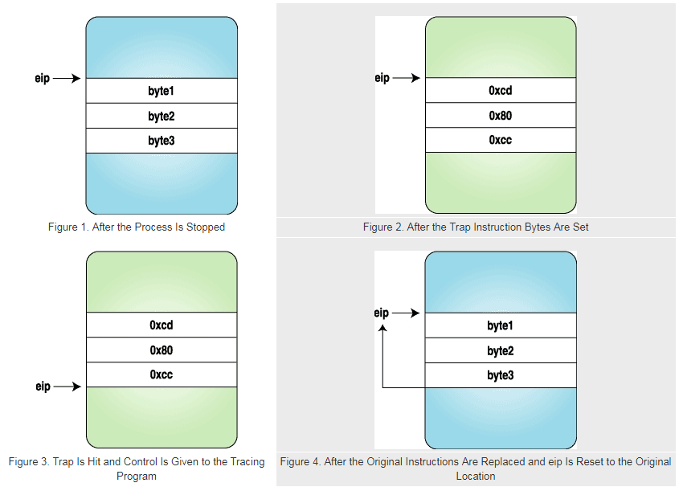

# 可行性报告

## 项目简介

rVisor 为一个基于用户空间（User Space）的通用安全沙箱环境。参考 gVisor 利用系统调用劫持的方法，实现进程级的虚拟化。在gVisor的基础上， 提供更高层次的共享机制，避免 go 语言 GC 的开销，为程序提供轻量高效的运行环境。

为 rVisor 避免 rVisor 在系统调用过程中的开销，在 rVisor 大体完成后，可以考虑将 rVisor 整体移入 Linux 内核，尝试解决 gVisor 进程级虚拟化的性能问题。

## 理论依据

### 安全沙箱

安全沙箱是一种用于隔离正在运行的程序的安全机制，通常是为了减轻系统故障或软件漏洞的蔓延。它通常用于运行未经测试或不受信任的软件，保护主机和操作系统免遭侵害。

沙箱为运行在其中的程序提供严格控制的资源集，如内存、外存的访问权限等等。沙箱通常也提供严格的网络访问控制、输入输出设备访问控制等。在本方案中，通过劫持系统调用严格监控、限制程序的访问权限。

安全沙箱的实现可以参考：Windows Sanbox , JAVA Sandbox等。

rVisor 本身就是一个安全的应用沙箱，利用 Linux 的 ptrace 系统调用实现。可以提供轻量的进程级虚拟化。

## 技术依据

### ptrace 系统调用

#### 概述

```c
#include <sys/ptrace.h> 
int ptrace(int request, int pid, int addr, int data);
```

ptrace系统调用提供了一个进程监视并修改另一个进程执行过程的能力。通过设置不同的request参数，父进程可以拦截被子进程的系统调用，读取、修改被子进程的内核镜像与寄存器的值。

常用的request参数如下：

| **请求**                         | **作用**                                           |
| -------------------------------- | -------------------------------------------------- |
| PTRACE_TRACEME                   | 本进程请求被其父进程所跟踪                         |
| PTRACE_PEEKTEXT, PTRACE_PEEKDATA | 从内存地址中读取一个字节，内存地址由addr给出       |
| PTRACE_POKETEXT, PTRACE_POKEDATA | 往内存地址中写入一个字节，内存地址由addr给出       |
| PTRACE_PEEKUSR                   | 从USER区域（含寄存器）中读取一个字节，偏移量为addr |
| PTRACE_POKEUSR                   | 往USER区域（含寄存器）中写入一个字节，偏移量为addr |
| PTRACE_GETREGS                   | 读取全部寄存器的值                                 |
| PTRACE_SYSCALL                   | 使子进程恢复运行，拦截下一次子进程发起的系统调用   |
| PTRACE_CONT                      | 使子进程恢复运行                                   |
| PTRACE_SINGLESTEP                | 使子进程恢复运行并设置单步执行标志                 |
| PTRACE_KILL                      | 杀掉子进程，使它退出                               |
| PTRACE_ATTACH                    | 跟踪指定pid 进程                                   |
| PTRACE_DETACH                    | 结束跟踪                                           |

#### 实例

一个（i386下）简单的使用ptrace的实例如下：

```c
#include <sys/ptrace.h>
#include <sys/types.h>
#include <sys/wait.h>
#include <unistd.h>
#include <linux/user.h>   

int main()
{   pid_t child;
    long orig_eax;
    child = fork();
    if(child == 0) {							//子进程部分
        ptrace(PTRACE_TRACEME, 0, NULL, NULL);	//子进程请求被监视
        execl("/bin/ls", "ls", NULL);			//子进程发起系统调用，此时子进程中断，唤醒父进程
    }
    else {										//父进程部分
        wait(NULL);								//等待至子进程发起系统调用
        orig_eax = ptrace(PTRACE_PEEKUSER,		
                          child, 4 * ORIG_EAX,
                          NULL);				//读取eax寄存器的值，本例(i386)保存系统调用号
        printf("The child made a "
               "system call %ld\n", orig_eax);
        ptrace(PTRACE_CONT, child, NULL, NULL);	//返回到子进程
    }
    return 0;
}
```

上例将会输出：

```markdown
The child made a system call 11
#ls的具体输出
```

若在上例的`wait(NULL)`至`ptrace(PTRACE_CONT,...)`段写入其他ptrace调用，则可以实现如读写子进程寄存器值、系统调用的参数、读写子进程内存地址等等功能。通过这些手段实现安全沙箱的功能。

更多实例可见：[Playing with ptrace, Part I](https://www.linuxjournal.com/article/6100)与 [Playing with ptrace, Part II](https://www.linuxjournal.com/article/6210)

#### ptrace执行过程

1. 父进程fork出子进程后进入等待，子进程请求被父进程跟踪
2. 当子进程调用系统调用后，父进程被唤醒
3. 父进程通过ptrace调用处理子进程
4. 子进程恢复执行，父进程继续跟踪

#### 更多用法

##### attach&detach

当两个进程间不互为父子进程时，调用`ptrace(PTRACE_ATTACH,...)`实现跟踪。父进程调用`ptrace(PTRACE_DETACH,...)`解除跟踪。

下列代码段实现了跟踪->输出第一次系统调用的信息->解除跟踪的过程：

```c
    ptrace(PTRACE_ATTACH, traced_process,
           NULL, NULL);
    wait(NULL);
    ptrace(PTRACE_GETREGS, traced_process,
           NULL, &regs);
    ins = ptrace(PTRACE_PEEKTEXT, traced_process,
                 regs.eip, NULL);
    printf("EIP: %lx Instruction executed: %lx\n",
           regs.eip, ins);
    ptrace(PTRACE_DETACH, traced_process,
           NULL, NULL);
```

##### 设置断点与代码注入

基本实现方法是：当子进程被中断后，父进程通过调用`ptrace(PTRACE_POKETEXT,...)`和`ptrace(PTRACE_POKEDATA,...)`向子进程写入指令。

设置断点的代码如下：

```c
    ptrace(PTRACE_ATTACH, traced_process,
           NULL, NULL);
    wait(NULL);

    ptrace(PTRACE_GETREGS, traced_process,
           NULL, &regs);							//保存寄存器值    
    getdata(traced_process, regs.eip, backup, 3);	//保存指令
 
	putdata(traced_process, regs.eip, code, 3);		//此处code是int3指令（中断）的代码
    ptrace(PTRACE_CONT, traced_process, NULL, NULL);

    wait(NULL);										//拦截int3指令
    printf("The process stopped, putting back "
           "the original instructions\n");
    printf("Press <enter> to continue\n");
    getchar();

    putdata(traced_process, regs.eip, backup, 3);	//放回指令
    ptrace(PTRACE_SETREGS, traced_process,
           NULL, &regs);							//放回寄存器值
    ptrace(PTRACE_DETACH, traced_process,
           NULL, NULL);
```

放回寄存器值的同时，也放回了指令指针&eip。

执行过程如下图：


在eip后写入了int3指令实现断点，触发断点后，又将原寄存器和指令写回(eip也回到了原始值)，则子进程被还原到原始状态。若要实现代码注入，可用同样方式实现。

## 技术路线

### 实现文件系统的隔离

### 实现进程管理

### 支持WASI

### 支持移动端平台

## 参考文献

sandbox(computer security): https://en.wikipedia.org/wiki/Sandbox_(computer_security)#

Playing with ptrace, Part I: https://www.linuxjournal.com/article/6100

Playing with ptrace, Part II: https://www.linuxjournal.com/article/6210
